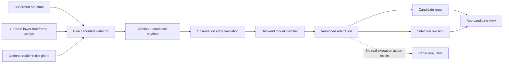

# RD 5m Multi-Entry Observation and Arbitration Design

**Date:** 2026-07-24

**Status:** Approved in conversation; awaiting review of this written specification

**Scope:** RD 5-minute strategy observation and paper-selection path

**Safety posture:** Observation/paper only; real execution remains prohibited

## Summary

The current RD strategy pipeline treats an entry setup as if it can have only one
entry model. Pine stores one `setupEntryModel`, the Python gate accepts one
`entry_model`, and the observation database constrains the value to either
`DIR_CLOSE` or `HTF_FLIP`. This loses information when more than one entry trigger
appears for the same setup and cannot represent the evidence needed to choose
between them.

This design replaces the single-choice entry representation with:

1. independent observation of every entry candidate;
2. source-backed normalization of obsolete patterns;
3. explicit proof fidelity for each candidate;
4. deterministic selection of one canonical candidate when the evidence allows it;
5. separate representation of entry handling, including delayed fills and re-entry;
6. a versioned payload and additive storage model that preserve existing history.

The system continues observing a setup after its first candidate. It does not place
real trades. Canonical selection means “the candidate the paper evaluator should
use,” not authorization to execute.

## Goals

- Handle every source-supported RD entry trigger applicable to the 5-minute strategy.
- Preserve every matched, blocked, normalized, and rejected entry pattern.
- Select one canonical paper candidate with a stable, auditable reason.
- Use only official RD Forex / RD Concepts evidence from March 2024 onward.
- Apply later source material only when it explicitly narrows, corrects, or
  supersedes an earlier rule.
- Distinguish setup qualification, entry triggers, fill handling, and re-entry.
- Detect replayable higher-timeframe flips when ordered lower-timeframe evidence is
  sufficient.
- Fail closed to shadow whenever event ordering or source fidelity is incomplete.
- Keep old observation records readable without fabricating missing candidates.

## Non-goals

- Real-money or broker execution.
- Portfolio-level selection between different pairs or unrelated setups.
- A 30-minute strategy contract.
- Reconstructing candidates that were not present in historical version 1 payloads.
- Treating live Pine tick state as reproducible historical proof.
- Inventing a priority among 15m, 30m, and 1h contexts when RD does not provide one.

## Approved design choices

The following choices were approved during design review:

- Limit this phase to entry behavior applicable to the 5-minute strategy.
- Store all candidates plus one canonical selection.
- Keep entry triggers separate from fill and re-entry handling.
- Prefer an earlier `HTF_FLIP` only when ordered evidence is exact.
- Fall back to an exact confirmed `DIR_CLOSE` when flip evidence is not exact.
- Normalize an eligible higher-timeframe break-candle pattern to `HTF_FLIP`.
- Reject generic 5-minute break-candle and rejection-only patterns as superseded.
- Keep the entire phase observation/paper-only.

## Terminology

### Setup qualification

Rules that establish whether a zone and setup are eligible before an entry trigger
is considered. The existing structural, freshness, liquidity, distance, invalidation,
and timing rules remain common setup gates.

An untapped or new zone is a qualification property, not an entry model.

### Lifecycle event

An event that changes setup state without authorizing entry. The first touch of an
eligible zone produces `ZONE_ENGAGED`. A blind first-touch entry is not a supported
entry model.

### Entry trigger model

A source-defined event that can produce an entry candidate after the common setup
gate passes. The canonical active models are `DIR_CLOSE` and `HTF_FLIP`.

### Entry candidate

An independently evaluated occurrence of an entry trigger for one setup. Candidates
are retained even when blocked, shadow-only, normalized, rejected, or not selected.

### Canonical selection

The single candidate chosen by the versioned arbitration policy for paper
evaluation. A selection may be `NONE`.

### Entry handling

How an already valid entry candidate is filled or retried. Handling does not create
setup qualification or replace the entry trigger model.

### Proof plane

The data plane used to establish event ordering:

- `CONFIRMED_5M`: committed closed 5m OHLC;
- `LOWER_TIMEFRAME_REPLAY`: chronological child-candle arrays;
- `REALTIME_TICK`: live Pine updates whose ticks are not retained after reload;
- `EXTERNAL_ARCHIVED_TICK`: a future independently archived tick feed.

## Source authority

### Allowed creator

Only material published by the official RD Forex / RD Concepts channel is
authoritative:

- handle: `@RD_Forex`;
- channel ID: `UC54xbL96tU58iez3YbTVTAg`.

The review covered the channel's relevant videos, livestreams, and Shorts from
2024-03-25 through 2026-07-15. Application-only examples may support a rule, but
they do not replace a later explicit definition or correction.

### Claim-level precedence

Precedence applies to claims, not to a fixed four-video role list.

Each cited claim records:

- channel ID and video ID;
- actual publication date;
- title snapshot;
- timestamp start and end;
- normalized claim ID;
- relationship: `SUPPORTS`, `NARROWS`, or `SUPERSEDES`;
- the earlier claim targeted by `NARROWS` or `SUPERSEDES`.

Rules:

1. An explicit later correction or narrowing wins over the conflicting portion of
   an earlier claim.
2. Later silence does not remove an earlier compatible rule.
3. A later trade example does not override a general rule unless the creator states
   the change.
4. Actual upload date is authoritative. A changed video title does not change the
   source chronology.
5. Third-party explanations cannot fill a gap in this contract.

### Core official evidence

| Published | Video | Relevant evidence |
|---|---|---|
| 2024-03-25 | [`kxh_3__oAqg`](https://www.youtube.com/watch?v=kxh_3__oAqg) | Untapped-zone definition at 3:43–4:58; historical standard close at 13:14–14:36; HTF flip at 14:52–16:45. |
| 2025-03-15 | [`84LZqvMiyos`](https://www.youtube.com/watch?v=84LZqvMiyos) | Historical Gold exception at 3:13–3:43; later directional close after respect at 10:26–10:41. |
| 2025-03-20 | [`Gr0njSOtC10`](https://www.youtube.com/watch?v=Gr0njSOtC10) | Explicit “closure or flip” correction and rejection-only removal at 51:46–52:29. |
| 2025-05-20 | [`f3X9T69y24c`](https://www.youtube.com/watch?v=f3X9T69y24c) | Optional next-candle wick spread mitigation at 0:40–1:37; prompt ordinary close entry at 3:31–3:43. |
| 2025-08-17 | [`E5EBc1MtiXQ`](https://www.youtube.com/watch?v=E5EBc1MtiXQ) | Directional close at 16:39–18:14; HTF set and flip definition at 19:49–22:25; boundary behavior at 23:35–24:33 and 31:46–34:48. |
| 2025-11-20 | [`UqYlKtPjKvY`](https://www.youtube.com/watch?v=UqYlKtPjKvY) | Discretionary break example explicitly described as rare and ruleless at 2:24–3:49; close fallback at 6:02–7:10. |
| 2026-05-21 | [`lo_7HDQK9WM`](https://www.youtube.com/watch?v=lo_7HDQK9WM) | Pure-flip narrowing at 60:47–66:24; rejection of non-HTF break entries at 73:08–73:15. |
| 2026-06-11 | [`zglv2r9xXnE`](https://www.youtube.com/watch?v=zglv2r9xXnE) | No ordinary entry without directional close at 10:55–11:05; HTF break normalized to flip at 11:19–11:34. |
| 2026-07-15 | [`T86aLDxzlbM`](https://www.youtube.com/watch?v=T86aLDxzlbM) | Continuation evidence for standard close and 15m/30m flips; no new general definition. |

### Source correction required

`LCydpj3CaHo` is published by Mangoe (`@_mangoe`), not RD Forex. It must be removed
from the authoritative contract. Its `DIR_CLOSE` citation is replaced by RD's own
`E5EBc1MtiXQ` evidence at 16:39–18:14. `rO5els-o3Oo` is also a Mangoe video and is
excluded.

## Entry taxonomy

### `DIR_CLOSE`

`DIR_CLOSE` is the universal/default 5-minute entry trigger.

For demand:

- the setup is engaged by a wick entering or touching the demand zone;
- no pre-entry invalidating close has occurred;
- a confirmed 5m candle closes bullish;
- the close is outside and above the demand zone.

For supply, the rule is symmetric:

- a confirmed 5m candle closes bearish;
- the close is outside and below the supply zone.

The engagement candle may qualify if its final confirmed close meets the rule.
A candle may first respect the zone without qualifying; a later candle may create
the directional close as long as no pre-entry invalidation occurs.

Detection from committed 5m OHLC is `EXACT`, subject to the fidelity of the common
setup and lifecycle rules.

### `HTF_FLIP`

`HTF_FLIP` is an intrabar trigger tied to the opening of a new 15m, 30m, or 1h
candle.

For demand:

1. the higher-timeframe candle is newly opened;
2. its zone-side move extends down into the demand zone;
3. the destination-side move was not already formed before the valid zone-side
   engagement;
4. price subsequently crosses upward through that same higher-timeframe candle's
   own open.

For supply, the sequence is symmetric:

1. the new higher-timeframe candle extends up into supply;
2. its downside move was not already formed before valid engagement;
3. price subsequently crosses downward through its own open.

The higher-timeframe open is fixed at the boundary. Unconfirmed HTF high, low, and
close values from repainting `request.security()` calls are not proof.

A single market event may satisfy several HTF contexts. One `HTF_FLIP` candidate
stores `htf_contexts`, for example `["15m", "30m", "1h"]`. The design does not
invent a priority between those contexts.

### `LEGACY_BREAK_CANDLE`

A generic 5m break-candle occurrence may be recorded as a rejected legacy pattern,
but it is never canonical.

When the event meets every `HTF_FLIP` requirement, it is normalized to
`HTF_FLIP`. Otherwise it receives `REJECT_GENERIC_BREAK_SUPERSEDED`.

### `LEGACY_REJECTION_RESPECT`

A candle that merely rejects or respects a zone without closing in the trade
direction may be recorded as a rejected legacy pattern. It receives
`REJECT_DIRECTIONAL_CLOSE_REQUIRED`.

### First touch

First touch produces `ZONE_ENGAGED`. It emits no entry candidate by itself.

## Entry handling

Entry handling is stored separately from the trigger model.

### Handling mode

- `CLOSE_CONFIRMATION`: use the confirmed `DIR_CLOSE` trigger price.
- `INTRABAR_FLIP`: use the proven `HTF_FLIP` trigger price.
- `NEXT_CANDLE_WICK`: after a valid `DIR_CLOSE`, optionally wait for the next
  candle's small counter-wick to mitigate spread. This can miss the trade and does
  not create a new entry trigger. Because the choice to use it is not fully
  deterministic in the source material, it remains observation-only until a
  separate fill policy is frozen.
- `AGGRESSIVE`: retained for research as `DISCRETIONARY` or `UNRESOLVED`; never
  eligible for canonical paper selection in this phase.

### Attempt kind

Re-entry is orthogonal to handling mode:

- `INITIAL`;
- `RE_ENTRY`.

This avoids losing information such as a re-entry that itself uses `DIR_CLOSE` and
`NEXT_CANDLE_WICK`. Re-entry eligibility, risk reduction, and session limits remain
paper-only until their own source rules are frozen. The observation layer records
them without assuming execution authority.

## Candidate contract

The version 2 entry candidate has this logical shape:

```text
EntryCandidate
  candidate_id
  setup_id
  model
  state
  event_anchor_epoch
  trigger_ordinal
  direction
  source_claim_ids[]
  normalized_from
  observed_at
```

`candidate_id` is a deterministic hash over immutable candidate identity fields,
including setup, normalized model, direction, event anchor, and trigger ordinal.
For `DIR_CLOSE`, the event anchor is the confirmed 5m candle. For `HTF_FLIP`, it is
the relevant higher-timeframe opening boundary. Resending the same market event
cannot create a second candidate.

Proof is append-only and separate from semantic candidate identity:

```text
EntryCandidateEvidence
  evidence_id
  candidate_id
  observed_trigger_epoch
  observed_trigger_price
  htf_contexts[]
  handling_mode
  attempt_kind
  fidelity
  proof_plane
  proof_resolution
  coverage_start
  coverage_end
  ambiguity_codes[]
  passed_rule_ids[]
  failed_rule_ids[]
  source_claim_ids[]
  payload_hash
  observed_at
```

`evidence_id` includes candidate ID, proof plane, proof resolution, coverage window,
and immutable payload hash. This lets replay, realtime, and a future archived feed
describe the same candidate without fabricating multiple entries. Candidate
fidelity is derived from the strongest complete replayable evidence; realtime-only
evidence cannot upgrade it. The displayed HTF contexts are the validated union of
the canonical evidence set.

Candidate `state` is one of:

- `MATCHED`;
- `BLOCKED`;
- `REJECTED`;
- `NORMALIZED`.

Fidelity remains one of:

- `EXACT`;
- `CALIBRATED`;
- `DISCRETIONARY`;
- `UNRESOLVED`.

Proof resolution is stored separately. “Exact at 1m resolution” does not claim that
the system has archived tick ordering inside a 1m child candle.

## Selection contract

The version 2 canonical selection has this logical shape:

```text
EntrySelection
  selection_id
  setup_id
  policy_version
  revision
  candidate_ids_considered[]
  canonical_candidate_id
  canonical_evidence_id
  reason
  fidelity
  action
  evaluated_at
```

`action` is limited to:

- `OBSERVE`;
- `PAPER_ELIGIBLE`;
- `SHADOW_ONLY`;
- `NONE`.

There is no real-execution action in the schema.

## Candidate matching

The model matcher evaluates all trigger models independently after the common setup
gate. Matching one candidate does not terminalize the setup.

For each event:

1. evaluate common setup qualification and pre-entry invalidation;
2. record lifecycle changes, including `ZONE_ENGAGED`;
3. evaluate `DIR_CLOSE`;
4. evaluate each applicable HTF context for `HTF_FLIP`;
5. combine the same flip event's matching HTF contexts;
6. record recognizable legacy patterns with rejection or normalization;
7. append candidates and then run arbitration.

A disabled or rejected legacy pattern never vetoes a valid active candidate.

## Proof and fidelity rules

### Confirmed 5m

`DIR_CLOSE` can be exact from a confirmed 5m candle when the full setup lifecycle
through entry is also unambiguous.

### Lower-timeframe replay

Pine uses one bounded `request.security_lower_tf()` tuple to obtain chronological
child arrays containing time, time-close, OHLC, and coverage markers. The scanner
walks child bars oldest-first.

An `HTF_FLIP` sequence is order-proven when:

- engagement is known from an earlier child bar or from the later child bar's open;
- the own-open recross occurs in a later child event; and
- every upstream lifecycle transition needed for the setup is also order-proven.

If first zone contact and first open recross exist only as the low and high of the
same child candle, their order is unknown. The candidate receives
`SHADOW_SAME_CHILD_BAR_ORDER`.

Missing arrays, partial coverage, gaps, or unavailable child history receive
`SHADOW_MISSING_INTRABAR_COVERAGE`.

### Realtime ticks

Pine may observe live arrival order using `varip`. Those ticks disappear after
reload and cannot be reproduced on historical charts. Such candidates use
`REALTIME_TICK` proof and remain `SHADOW_ONLY` with
`SHADOW_REALTIME_ONLY_NOT_REPLAYABLE`.

Realtime tick evidence cannot silently upgrade a replay candidate.

### External archived ticks

An external archived tick engine is the future path to replayable tick-level proof.
It is not required for this phase and cannot authorize real execution without a
separate approved design.

## Canonical arbitration

Arbitration runs per setup and policy version:

1. If common setup qualification fails or the setup is invalidated, select `NONE`.
2. Ignore first touch as an entry candidate.
3. Retain every candidate, including blocked and rejected candidates.
4. Only candidates with complete exact setup and trigger evidence can become
   `PAPER_ELIGIBLE`.
5. If an exact `HTF_FLIP` occurred before an exact `DIR_CLOSE`, select the flip with
   `EARLIEST_EXACT_TRIGGER`.
6. If flip evidence is incomplete or shadow-only and an exact `DIR_CLOSE` later
   appears, select the close with `FALLBACK_TO_CONFIRMED_CLOSE`.
7. If only non-exact candidates exist, select `NONE` with
   `NO_EXACT_CANDIDATE`; retain the candidates as shadow observations.
8. If multiple HTF contexts describe the same flip event, preserve all contexts on
   one candidate rather than choosing a timeframe.
9. If distinct candidates have the same trigger epoch and source evidence provides
   no winner, use a stable technical ordering only for serialization and return
   `SHADOW_ONLY` with `UNRESOLVED_SOURCE_PRIORITY`.

Choosing the earlier exact flip is an approved product arbitration policy inferred
from flip-as-entry and close-as-fallback teaching. It is not represented as an
explicit universal RD ranking rule.

Each selection is revisioned. A later exact close may replace `NONE`, but a later
arrival cannot rewrite the identity or evidence of an earlier candidate. Selection
history remains auditable.

## System architecture

### Contract versions

- Freeze the current rule and observation contracts as version 1 history.
- Introduce RD strategy contract `2.0.0`.
- Introduce observation evidence payload `2.0`.
- Accept version 1 and version 2 payloads during rollout.
- Do not reinterpret a version 1 row as if it contained version 2 evidence.

### Pine detector

The existing confirmed-5m engine remains the authoritative committed Pine state.
Pine gains:

- a candidate collection instead of one `setupEntryModel`;
- HTF boundary detection for 15m, 30m, and 1h;
- one bounded lower-timeframe tuple request;
- a pure chronological child-bar scanner;
- deterministic candidate IDs and evidence provenance;
- continued setup observation after the first candidate;
- compact, versioned evidence export;
- explicit ambiguity and coverage codes.

The optional realtime `varip` plane is isolated and labeled. It never mutates
historical/replay proof.

Only active or armed zones are scanned. `calc_bars_count` and candidate retention
are bounded and profiled before rollout.

### Observation edge

The edge:

1. validates the envelope and payload version;
2. stores an idempotent receipt;
3. validates candidate evidence;
4. independently applies the versioned domain matcher and arbitration policy;
5. stores candidates and a selection revision transactionally;
6. exposes the result to the app.

Pine-provided canonical choices are treated as diagnostic comparisons, not backend
authority.

### Storage

Existing version 1 observation tables remain unchanged.

Additive version 2 storage includes:

- `observation_entry_candidates`: one immutable row per candidate;
- `observation_entry_candidate_evidence`: append-only proof records;
- `observation_entry_selections`: revisioned canonical decisions;
- `observation_entry_handling`: fill and re-entry observations;
- versioned source claims and claim relationships.

Arrays such as HTF contexts and rule IDs may be stored as validated canonical JSON
where relational expansion does not improve querying. Database constraints enforce
allowed model, state, fidelity, action, and reason values.

### Payload size and delivery

TradingView alert messages have a finite size and script-alert rate limits.
Candidate export therefore:

- uses compact field names on the wire with typed expansion at the edge;
- batches candidates by setup;
- keeps a conservative payload ceiling below the platform maximum;
- uses deterministic `batch_id`, `chunk_index`, and `chunk_count` if a batch must
  be split;
- assembles chunks idempotently and rejects inconsistent duplicate chunks;
- limits alert frequency so candidate detail cannot disable the TradingView alert.

### App

The app shows:

- common setup status;
- all active and legacy candidates;
- trigger time and price;
- proof plane and resolution;
- HTF contexts;
- fidelity and ambiguity codes;
- handling mode and attempt kind;
- canonical candidate or `NONE`;
- selection reason and policy version;
- source citations.

The UI must not label `REALTIME_TICK` or resolution-limited proof as archived
tick-exact evidence.

## Data flow



## Error handling

- Unknown payload versions are rejected with an explicit receipt status.
- Unknown enum values or malformed evidence are rejected, not coerced.
- Duplicate candidate and evidence IDs are idempotent only when their canonical
  payload hashes match; conflicting duplicates are quarantined.
- Out-of-order arrivals may create a later selection revision but cannot mutate an
  immutable candidate.
- Missing lower-timeframe data fails closed to shadow.
- Same-child-bar ordering fails closed to shadow.
- Realtime-only proof fails closed to shadow.
- A source claim referencing a non-official channel fails contract validation.
- A source relationship referencing an unknown claim fails contract validation.
- Payload chunk timeouts and inconsistent chunks produce an incomplete receipt and
  no partial selection.
- Backend and Pine selection disagreements are stored as parity failures and never
  silently accepted.

## Verification

### Contract tests

- Only the official RD channel is accepted.
- More than four source claims can be represented.
- Claim relationships reference known claims and do not form invalid cycles.
- The Mangoe source is absent.
- The contract contains no real-execution action.
- Generated JSON Schema and typed validation agree on candidate arrays, uniqueness,
  enums, and required fields.

### Domain golden fixtures

Fixtures contain ordered 5m and child OHLC, feed identity, tick size, timestamps,
expected transitions, source claim IDs, and expected candidate/selection output.

Required cases:

- valid `DIR_CLOSE` on the engagement candle;
- valid later `DIR_CLOSE` after a non-qualifying respect candle;
- close inside or through the zone before entry;
- exact 15m, 30m, and 1h flip examples;
- one flip with multiple HTF contexts;
- contact and recross in different child candles;
- ambiguous contact and recross in the same child candle;
- missing or partial child coverage;
- exact flip followed by an exact close;
- shadow flip followed by an exact close fallback;
- only non-exact candidates;
- generic break-candle rejection;
- HTF break normalization to flip;
- rejection/respect-only rejection;
- next-candle wick handling;
- initial entry and re-entry observations;
- replay and realtime evidence correlated to one semantic candidate;
- duplicate and out-of-order events.

### Pine parity

An offline Python oracle processes the identical ordered child OHLC stream. Pine
logs are compared against oracle:

- candidate IDs;
- trigger epochs;
- HTF contexts;
- proof resolution;
- ambiguity codes;
- model normalization;
- canonical diagnostic output.

Pine compilation, bounded performance, payload size, and alert frequency are
verified separately. Bar Replay is not treated as a webhook-delivery test.

### Edge, storage, and API

- version 1 compatibility;
- version 2 validation;
- transactional candidate plus selection storage;
- idempotent receipts;
- chunk assembly;
- conflicting duplicate quarantine;
- selection revision history;
- API filtering by model, fidelity, reason, and setup;
- UI rendering for multiple candidates and `NONE`.

### Safety tests

- no payload or domain result can express a live trade command;
- shadow candidates cannot become paper-eligible;
- discretionary and unresolved candidates cannot become canonical;
- missing proof cannot default to exact;
- backend/Pine disagreement cannot authorize paper selection.

## Rollout

1. Commit the version 2 source claims, typed contract, and generated schema.
2. Deploy additive database migrations and dual-version edge validation.
3. Deploy API and app support for candidate and selection views.
4. Publish the new Pine detector with all new candidate paths shadow-only.
5. Run historical lower-timeframe parity against the Python oracle.
6. Run forward shadow observation and reconcile Pine, edge, and oracle output.
7. Enable canonical paper selection only after the agreed parity and coverage gates
   pass.
8. Keep real execution disabled. Any future execution proposal requires a new
   contract, threat review, and explicit approval.

## Acceptance criteria

- The system stores more than one entry candidate for a setup.
- The same market trigger observed on more than one proof plane remains one
  candidate with multiple evidence records.
- A first candidate does not stop later candidate observation.
- `DIR_CLOSE` and `HTF_FLIP` are independently detected and source-cited.
- Eligible HTF break behavior is normalized to `HTF_FLIP`.
- Generic break and rejection-only patterns are retained as rejected legacy
  observations and never selected.
- Multiple HTF contexts are preserved without arbitrary timeframe priority.
- Canonical selection follows the approved exact-flip/confirmed-close policy.
- Every non-selection and fallback has a stable reason code.
- Ambiguous, missing, realtime-only, calibrated, discretionary, and unresolved
  evidence fails closed.
- Existing version 1 history remains readable and unchanged.
- The third-party Mangoe source is removed from authority.
- The app exposes candidates, evidence, canonical selection, and source citations.
- Contract, domain, Pine parity, edge, migration, API, UI, and safety tests pass.
- No real-execution path is introduced.
